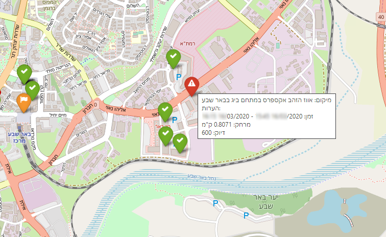

# Cross referencing Google location history with MOH COVID-19 exposure locations

## Important notice!
> This code was **not** created with accuracy in mind, this is a POC and I really wanted to try my hand with pandas and used COVID-19 as an excuse. Please **do not** rely on the results.
I know for a fact that some locations that are marked as "clear" (location history indicated not in proximity of location) also have additional date and time information in the comment field.

## Notes
- This code calculates location history distance from exposure locations without any distance consideration.
- The code is not just **not optimized**, it bad, slow and unreadable.
- First time using pandas, didn't read the documentation. Also, not a programmer.
- It does work...

## Known bugs
- MOH timestamp fields are untrustworthy, therefore a combination of the timestamp and a stayTimes string  is used.
- If a stayTimes string is ends before it begins (such as "09:00 - 02:00") no corrections are made to the date and location is ignored.
- If the stayTimes string is "לא ידוע" ("Unknown"), there is not attempt done to select the full time range.
- MOH like to add additional exposure times in the comment field, I ignore them.

## Testing
With the supplied myData.json and govData.json, there should be 1169 cases of unknown locations marked orange on the map. Out of the 132 known locations, 130 should be ok (green) and 2 should be too close to an exposure location and marked with a red marker on the map (one in Ra'anana
 and another at the Ruppin academic centre).

## Logic behind the code
    None.
